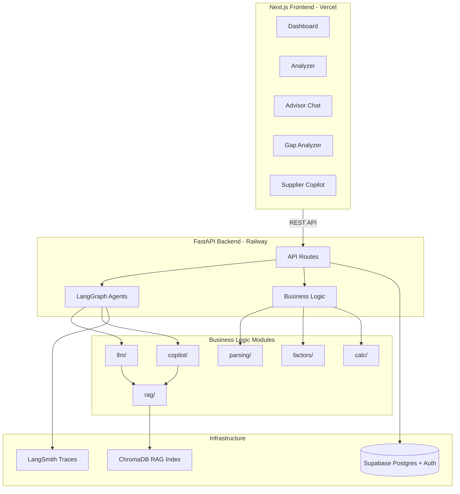

# Product Carbon Footprint Analyzer

A production-grade tool for sustainability analysts at consumer goods companies to estimate product-level Scope 3 footprints from messy Bill of Materials (BOM) data. Upload a BOM, match emission factors, calculate cradle-to-gate emissions, identify hotspots, and engage suppliers — with auditable methodology and human-in-the-loop review checkpoints.

## Architecture



### Module dependency rules

| Module | Responsibility | Imports from |
|--------|---------------|--------------|
| `parsing/` | BOM ingestion, normalization, unit conversion | — |
| `factors/` | Emission factor lookup (Open CEDA 2025) | `parsing/` |
| `calc/` | Footprint calculation, aggregation, critic | `factors/`, `parsing/` |
| `llm/` | Conversational advisor | `rag/` |
| `copilot/` | Supplier email drafting | `rag/` |
| `api/` | FastAPI routes, LangGraph orchestration | all business logic |
| `frontend/` | Next.js UI | HTTP only |

No Streamlit calls outside `app.py`. No calculations inside `api/` routes — routes orchestrate, modules compute.

## Setup

### Prerequisites

- Python 3.13
- Node.js 20+ (for frontend, when initialized)
- Supabase project (for auth and persistence)
- Anthropic API key (for LLM features)

### Backend

```bash
# Clone and enter the project
cd product-footprint-analyzer

# Create virtual environment
python -m venv .venv
source .venv/bin/activate

# Install dependencies
pip install -r requirements.txt

# Copy environment template and fill in values
cp .env.example .env
```

Required environment variables (see `.env.example`):

| Variable | Purpose |
|----------|---------|
| `ANTHROPIC_API_KEY` | Advisor, gap analyzer, supplier copilot LLM calls |
| `SUPABASE_URL` | Database and auth |
| `SUPABASE_ANON_KEY` | JWT verification |
| `SUPABASE_JWT_SECRET` | Optional JWT secret for token verification |
| `DATABASE_URL` | Postgres connection for LangGraph checkpointer |
| `LANGSMITH_API_KEY` | Tracing and eval observability |
| `LANGSMITH_TRACING` | Set to `true` to enable |

### RAG index (required for advisor guidance and supplier emails)

```bash
python -m rag.ingest
```

### Run the API

```bash
uvicorn api.main:app --reload
```

Interactive API docs: http://localhost:8000/docs

### Run tests and evals

```bash
# Unit tests
pytest tests -v

# Deterministic golden-file evals (no API keys needed)
pytest evals/test_golden_files.py -v

# LLM-as-judge evals (requires ANTHROPIC_API_KEY + RAG index)
python -m evals.llm_judge

# CI-safe skip when key is absent
python -m evals.llm_judge --skip-without-key

# Lint
ruff check .
```

### Frontend

The `frontend/` directory contains Next.js page components. Initialize the full Next.js project with TypeScript, Tailwind, and shadcn/ui before deploying to Vercel. Set `NEXT_PUBLIC_SUPABASE_URL`, `NEXT_PUBLIC_SUPABASE_ANON_KEY`, and `NEXT_PUBLIC_API_URL` in `frontend/.env.local`.

## Eval Strategy

The eval pipeline has two layers designed for different CI contexts:

### 1. Deterministic golden-file evals (every PR)

Located in `evals/golden_files/`. Each case mirrors a BOM example from `Specs`:

| Case | Description |
|------|-------------|
| `clean_tshirt` | Clean cotton T-shirt — all rows matched, no flags |
| `messy_tshirt` | Missing fields, ambiguous material, duplicates |
| `water_bottle` | Edge cases: no EF match, low-confidence match |

Each case includes a CSV input and a JSON fixture with deterministic emission factor matches (with source citations). This avoids depending on the Open CEDA Excel file in CI.

**Invariants asserted** (from `CLAUDE.md`):

- `total_kg_co2e` equals the sum of matched line item emissions
- `kg_co2e = spend_usd × ef_kg_co2e_per_usd` for every matched row
- Every matched emission factor has a traceable `ef_source` citation
- Same input produces identical output on repeated runs (determinism)
- Unmatched and low-confidence items are flagged appropriately

Run: `pytest evals/test_golden_files.py -v`

### 2. LLM-as-judge evals (nightly / manual)

Located in `evals/llm_judge.py` with fixture cases in `evals/fixtures/`. A separate Claude model scores advisor responses and supplier email drafts against rubrics:

**Advisor rubric:** grounded in context, no fabricated numbers, no supplier/investment prescriptions, analyst-friendly tone, addresses the question.

**Email rubric:** GHG Protocol citation, requests activity data / EF / methodology / system boundary, 14-day deadline, professional tone, contact-aware greeting.

These require `ANTHROPIC_API_KEY` and a built RAG index. CI runs them with `--skip-without-key` on PRs; the nightly workflow (`.github/workflows/eval.yml`) runs them live when secrets are configured.

Run: `python -m evals.llm_judge`

### Observability

- **LangSmith** — auto-traces every LangGraph agent run and LLM call when `LANGSMITH_TRACING=true`
- **Custom audit log** — Supabase `audit_log` table records user actions
- **Golden snapshots** — deterministic serialized outputs enable regression detection without live LLM calls

## API Endpoints

| Endpoint | Method | Description |
|----------|--------|-------------|
| `/health` | GET | Health check |
| `/api/analyze/parse` | POST | Parse uploaded BOM CSV |
| `/api/analyze/match-factors` | POST | Match emission factors |
| `/api/analyze/calculate` | POST | Calculate footprint |
| `/api/analyze` | POST | Full pipeline (parse → match → calculate) |
| `/api/analyses` | GET/POST | List or save analyses |
| `/api/advisor/chat` | POST | Conversational advisor |
| `/api/gap-analysis/plan` | POST | Generate gap analysis plan |
| `/api/gap-analysis/execute` | POST | Execute gap analysis step |
| `/api/copilot/draft-email` | POST | Draft supplier outreach email |

All endpoints except `/health` require a Supabase JWT in the `Authorization: Bearer` header.

## Project Structure

```
product-footprint-analyzer/
├── api/                  # FastAPI routes, LangGraph graphs, middleware
├── calc/                 # Footprint calculation and critic
├── copilot/              # Supplier engagement workflows
├── evals/                # Golden-file and LLM judge evals
│   ├── golden_files/     # Spec BOM test cases + EF fixtures
│   └── fixtures/         # LLM judge input cases
├── factors/              # Emission factor lookup (Open CEDA 2025)
├── frontend/             # Next.js UI (pages in src/)
├── gap_analyzer/         # GHG Protocol gap analysis tools
├── llm/                  # Advisor client and router
├── parsing/              # BOM parser
├── rag/                  # GHG Protocol RAG pipeline
├── supabase/migrations/  # Postgres schema + RLS
├── tests/                # Unit and API integration tests
└── sample_boms/          # Example BOM CSV files
```

## References

- [Architecture Decisions](Architecture_Decisions.md) — rationale for every stack choice
- [Implementation Plan](IMPLEMENTATION_PLAN.md) — phased build sequence
- [Specs](Specs) — input/output schema and BOM test cases
- [CLAUDE.md](CLAUDE.md) — domain rules, eval invariants, and coding conventions
